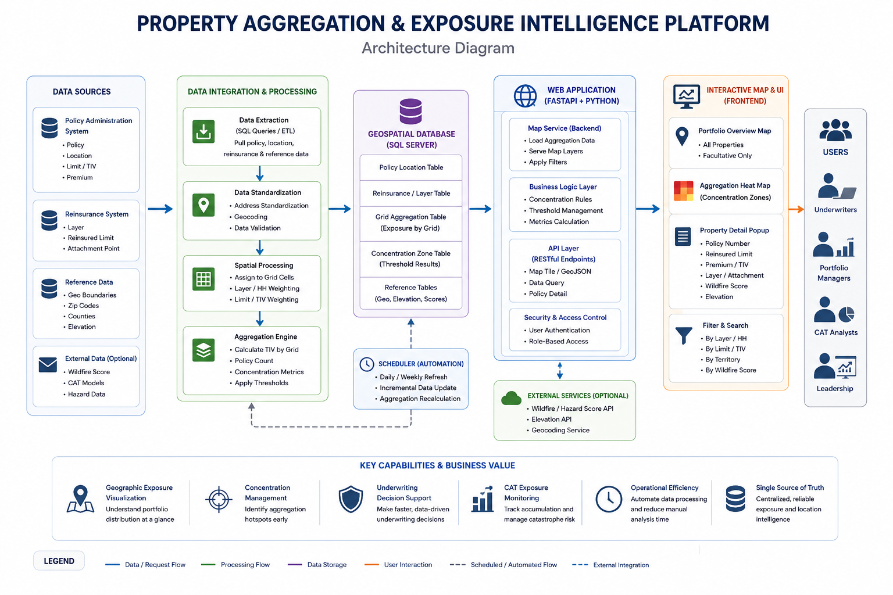
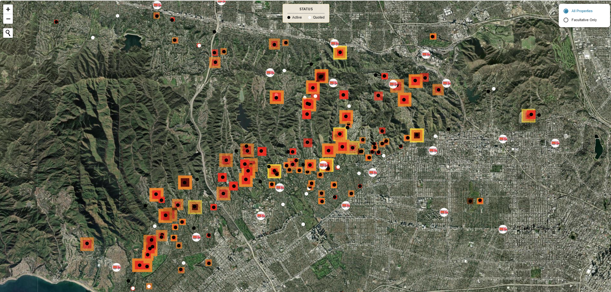
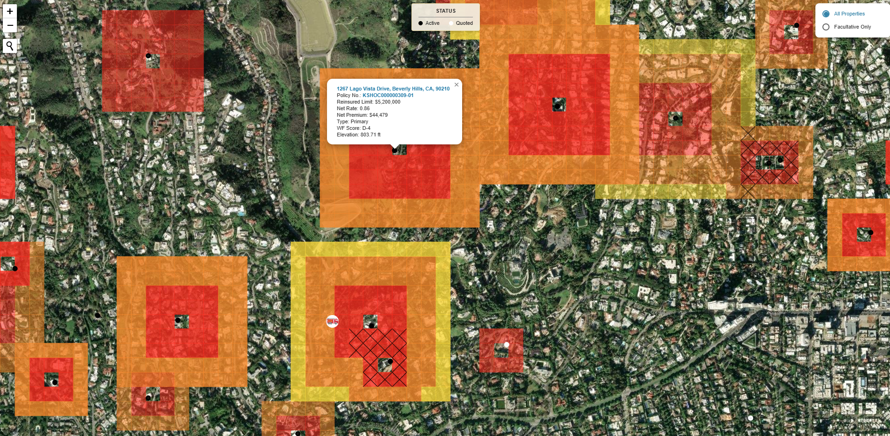

# Property Aggregation & Exposure Intelligence Platform

A geospatial underwriting analytics tool designed to help underwriters evaluate property concentration, portfolio accumulation, and exposure hotspots.

## Business Problem

Commercial property underwriters need to understand not only individual property risk, but also geographic concentration across the portfolio. Manual spreadsheet review makes it difficult to identify aggregation hotspots quickly.

## Solution

This project provides an interactive map-based platform that visualizes property locations, concentration zones, facultative placements, and underwriting metrics in one interface.

## Key Features

- Portfolio exposure overview
- Active vs quoted property filtering
- Facultative placement filtering
- Grid-based exposure aggregation
- Concentration hotspot visualization
- Property-level detail popups
- Underwriting decision support

## Architecture

## Sample Implementation

A simplified example of the aggregation logic used for portfolio concentration analysis is included in:

`sample_property_aggregation.py`

This sample demonstrates:

- Geospatial aggregation
- Grid-based concentration analysis
- Interactive map generation
- Exposure visualization

All business-sensitive logic and production data have been removed.

## Screenshots

### Portfolio Exposure Overview

### Exposure Concentration Detail

## Business Impact

- Improved visibility into geographic risk concentration
- Supported underwriting accumulation management
- Reduced manual portfolio review effort
- Enhanced catastrophe exposure monitoring
- Enabled faster underwriting decisions

## Portfolio Case Study

[Download the full case study](docs/ClaireDong_Portfolio_Property_Aggregation_Exposure_Intelligence_Platform.pdf)

## Note

This repository contains a sanitized portfolio version. Sensitive business data, customer information, and internal system details have been removed or anonymized.
